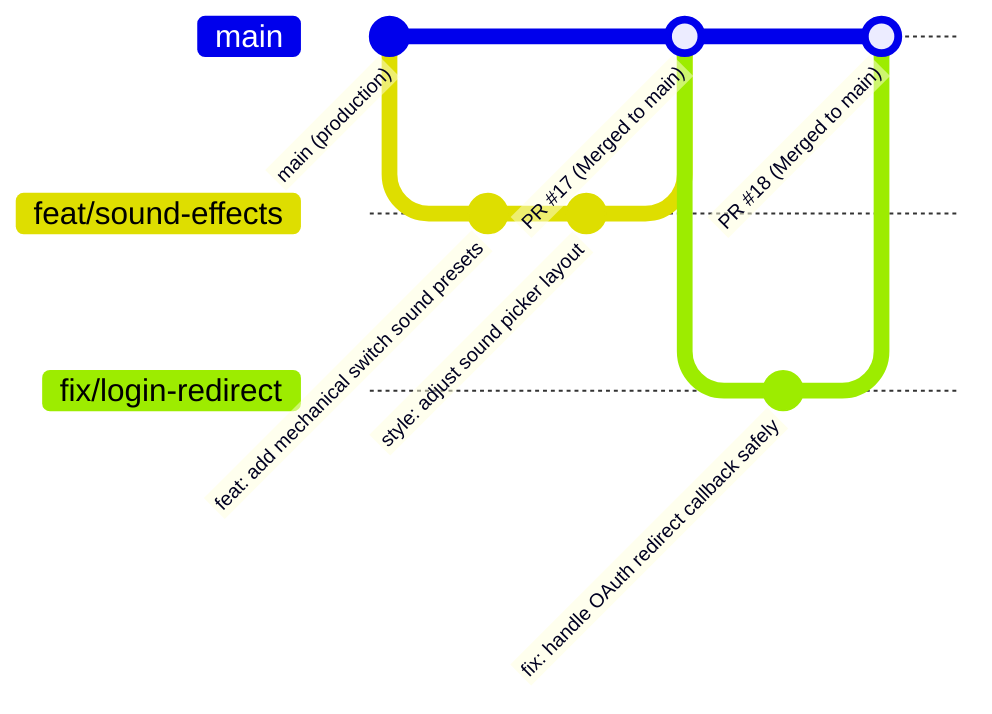

# ZenType Git & Development Workflow Guide

This document outlines the standard Git workflow, branching strategy, commit conventions, and development procedures for the ZenType repository. **All developers and AI agents must reference and follow these rules.**

---

## 1. Branch Strategy (GitHub Flow)

ZenType follows a continuous-deployment **GitHub Flow** model centered around the `main` branch.

- **`main`**: Production branch. Always deployable and clean. Merges to `main` trigger automated production builds and deployments.
- **Feature & Fix Branches**: All development work is done on short-lived branches created off the latest `main`.



---

## 2. Branch Naming Conventions

Always use descriptive, lowercase names with a valid type prefix:

| Prefix | Usage | Example |
| :--- | :--- | :--- |
| `feat/` | New features or functionality | `feat/keyboard-sound-variants` |
| `fix/` | Bug fixes and defect corrections | `fix/avatar-skeleton-shift` |
| `refactor/` | Code refactoring without behavior change | `refactor/results-store-hooks` |
| `style/` | UI, layout, typography, or styling updates | `style/standardize-tab-gap` |
| `perf/` | Performance optimizations | `perf/dynamic-chart-import` |
| `docs/` | Documentation changes | `docs/git-workflow-guide` |
| `chore/` | Tooling, dependencies, build configs | `chore/update-tailwind-plugins` |

---

## 3. Standard Feature & Bug Fix Workflow

### Step 1: Synchronize `main`
Always ensure your local `main` is up to date before branching:
```bash
git checkout main
git pull origin main
```

### Step 2: Create a Feature Branch
```bash
git checkout -b feat/your-feature-name
```

### Step 3: Implement & Validate
Make your changes, then verify compilation and type safety:
```bash
# Typecheck
npx tsc --noEmit

# Production Build Test
npm run build
```

### Step 4: Commit Changes
Commit changes using semantic commit messages:
```bash
git add <files...>
git commit -m "feat: add custom sound presets" -m "Adds cherry mx blue and brown audio profiles with audio context caching."
```

### Step 5: Push and Open a Pull Request
Push your branch to GitHub and create a Pull Request:
```bash
git push -u origin feat/your-feature-name
gh pr create --base main --head feat/your-feature-name --title "feat: add custom sound presets" --body "## Summary of Changes..."
```

### Step 6: Merge & Cleanup
Once PR checks pass, merge the PR into `main` and delete the remote branch:
```bash
gh pr merge <PR_NUMBER> --merge --delete-branch
git checkout main
git pull origin main
git branch -d feat/your-feature-name
```

---

## 4. Large Refactors & High-Risk Changes (Git Worktree Flow)

When undertaking massive refactors, complex migrations, or experiments that could break the primary workspace, **use an isolated Git worktree**.

### Why Worktrees?
- Completely isolates experimental code from your main working directory.
- Allows switching tasks or verifying production fixes without `git stash` or losing unstaged work.
- Guarantees clean branch verification before merging.

### Step-by-Step Worktree Workflow:

1. **Create an isolated worktree outside the current project directory:**
   ```bash
   git worktree add ../zentype-refactor -b refactor/major-architecture-overhaul
   ```

2. **Navigate to the worktree and develop:**
   ```bash
   cd ../zentype-refactor
   # install dependencies if needed
   npm install
   ```

3. **Verify and build inside the worktree:**
   ```bash
   npx tsc --noEmit
   npm run build
   ```

4. **Commit and push from the worktree:**
   ```bash
   git add .
   git commit -m "refactor: restructure state stores and API client"
   git push -u origin refactor/major-architecture-overhaul
   ```

5. **Open and merge PR:**
   ```bash
   gh pr create --base main --head refactor/major-architecture-overhaul --title "refactor: restructure state stores" --body "..."
   gh pr merge --merge --delete-branch
   ```

6. **Clean up the worktree:**
   ```bash
   cd ../zentype
   git worktree remove ../zentype-refactor
   git worktree prune
   git checkout main
   git pull origin main
   ```

---

## 5. Commit Message Conventions (Semantic Commits)

Commit messages must follow the [Conventional Commits](https://www.conventionalcommits.org/) standard:

```
<type>(<optional scope>): <description in lowercase>

[optional body explaining rationale and non-obvious details]
```

### Commit Types:
- `feat`: A new user-facing feature or enhancement.
- `fix`: A bug fix.
- `style`: Changes that do not affect code logic (whitespace, CSS styling, formatting, UI gap standardizations).
- `refactor`: Code changes that neither fix a bug nor add a feature.
- `perf`: Code changes that improve performance.
- `docs`: Documentation changes only (`README.md`, `STYLE_GUIDE.md`, etc.).
- `chore`: Build process, tooling configs, package updates.
- `test`: Adding or modifying tests.

### Rules:
- Keep the title line concise and lowercase (e.g. `fix: navbar level skeleton and instant login loading state`).
- Use imperative, present tense ("add", "fix", "standardize", NOT "added", "fixing").
- Do not end the subject line with a period.
- Include a descriptive body when the change has non-trivial rationale.

---

## 6. Keeping Branches Up to Date (Avoiding Conflicts)

If `main` has progressed while working on a feature branch, rebase onto `main` before opening or merging a PR:

```bash
git checkout feat/my-branch
git fetch origin
git rebase origin/main
```

If conflicts occur:
1. Resolve the conflicted files.
2. `git add <resolved-files>`
3. `git rebase --continue`
4. Force push the rebased branch: `git push --force-with-lease origin feat/my-branch`

---

## 7. AI Agent Guidelines

AI agents interacting with the ZenType codebase must follow these directives:
1. **Auto-commit**: Immediately stage and commit changes after making code edits.
2. **Strict Semantic Commits**: Never use generic messages like "update files" or "fix bugs". Always specify type and descriptive subject.
3. **Verify Build**: Always run `npx tsc --noEmit` and/or `npm run build` after complex changes to prevent broken builds.
4. **Isolate Major Work**: Use `git worktree` for large-scale multi-file architectural refactors.
