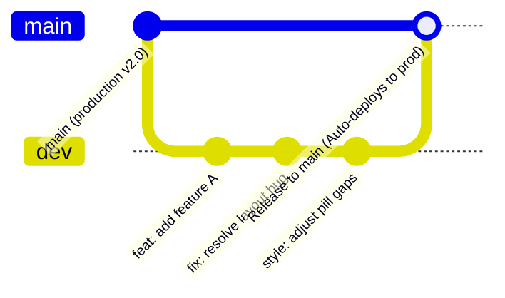

# zentype Git & Development Workflow Guide

How zentype is developed: the branch strategy, commit conventions, and release flow. Anyone working on the repo, human or AI, should follow it.

---

## 1. Branch Strategy (`dev` $\rightarrow$ `main`)

zentype uses a simple two-branch model:

- **`main`**: production. Always deployable. Pushing or merging here triggers an automated production deploy, so nothing lands on it directly.
- **`dev`**: where day-to-day work happens. Features, fixes, and routine commits all go here.



---

## 2. Daily Development Flow

### Step 1: Stay on `dev`
Always ensure your local `dev` branch is up to date:
```bash
git checkout dev
git pull origin dev
```

### Step 2: Implement & Validate
Make changes, test locally, and verify compilation and types:
```bash
# Typecheck
bunx tsc --noEmit

# Production build check (optional for large changes)
bun run build
```

### Step 3: Semantic Commit & Push
Commit directly to `dev` with clear semantic commit messages:
```bash
git add <files...>
git commit -m "feat: add mechanical switch sound presets"
git push origin dev
```

---

## 3. Releasing to Production (`main`)

When features or fixes on `dev` are tested and ready for production:

### Option A: Local Merge & Push (Fastest)
```bash
# 1. Switch to main and pull latest
git checkout main
git pull origin main

# 2. Merge dev into main
git merge dev

# 3. Push to production (triggers automated deploy)
git push origin main

# 4. Switch back to dev for ongoing work
git checkout dev
```

### Option B: Release Pull Request (GitHub)
```bash
gh pr create --base main --head dev --title "release: v2.x updates" --body "## Summary of Changes..."
gh pr merge --merge
git checkout main && git pull origin main && git checkout dev
```

---

## 4. Large Refactors & Experiments (Worktree Flow)

When undertaking massive architectural rewrites or risky experiments that might break your working copy, **use an isolated Git worktree**:

1. **Create an isolated worktree off `dev`:**
   ```bash
   git worktree add ../zentype-experiment -b experiment/feature-name
   ```
2. **Develop and test inside `../zentype-experiment`:**
   ```bash
   cd ../zentype-experiment
   bunx tsc --noEmit
   bun run build
   ```
3. **Merge back to `dev` once validated:**
   ```bash
   cd ../zentype
   git merge experiment/feature-name
   git push origin dev
   ```
4. **Clean up the worktree:**
   ```bash
   git worktree remove ../zentype-experiment
   git branch -d experiment/feature-name
   ```

---

## 5. Commit Message Conventions (Semantic Commits)

Commit messages follow [Conventional Commits](https://www.conventionalcommits.org/):

```
<type>(<optional scope>): <description in lowercase>

[optional body explaining rationale and non-obvious details]
```

### Commit Types:
- `feat`: A new user-facing feature or enhancement.
- `fix`: A bug fix.
- `style`: UI styling, whitespace, layout, gap standardizations.
- `refactor`: Code changes that neither fix a bug nor add a feature.
- `perf`: Performance optimizations.
- `docs`: Documentation changes only.
- `chore`: Tooling, build config, dependency updates.
- `test`: Adding or modifying tests.

### Rules:
- Subject line must be lowercase and imperative (e.g. `feat: add dark mode toggle`, NOT `Added dark mode`).
- No trailing period in subject line.
- Include a message body when the change requires extra context.

---

## 6. AI Agent Guidelines

AI agents operating on the zentype codebase must:
1. **Work on `dev`**: Never commit directly to `main`.
2. **Auto-commit**: Immediately stage and commit changes after making code edits.
3. **Strict Semantic Commits**: Always format commits with standard semantic types and descriptive summaries.
4. **Verify Safety**: Run `bunx tsc --noEmit` on TypeScript changes to guarantee zero type errors before committing.
